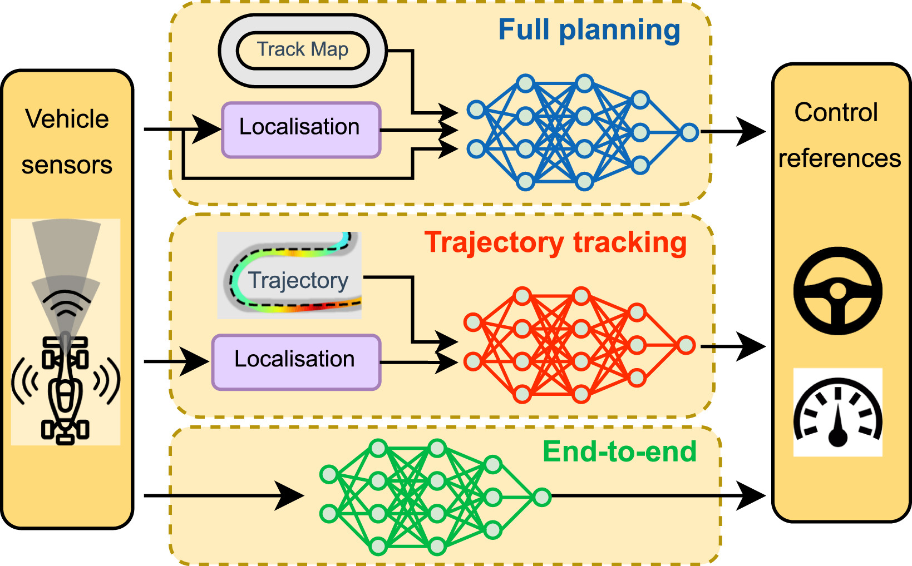
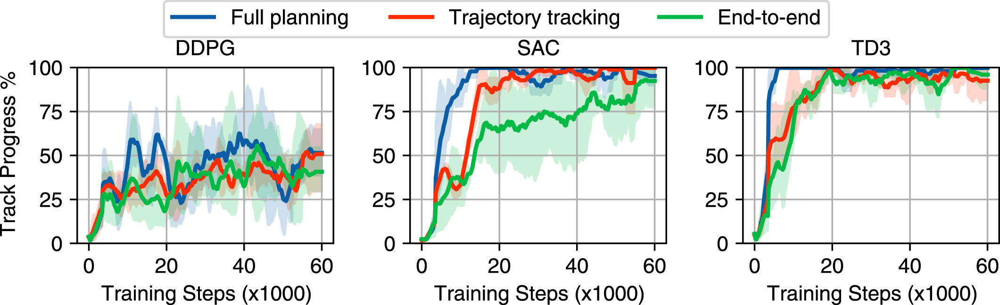
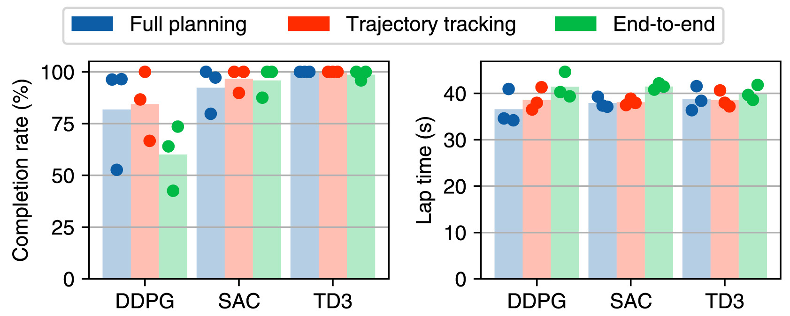
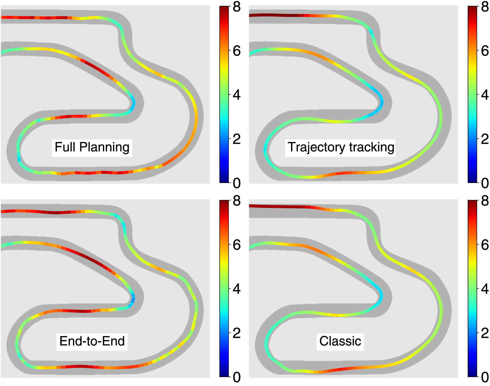
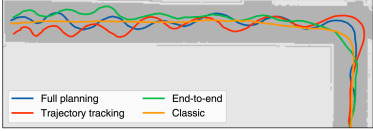
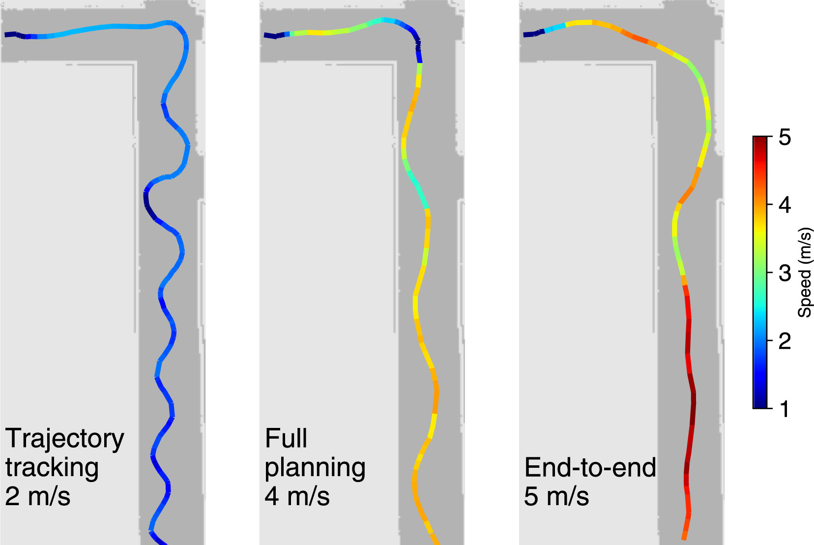

# f1tenth_drl

Deep reinforcement learning experiments for simulated F1Tenth autonomous racing.

1. [Result highlights](#highlights)
2. [Major results](#major-results)
3. [Usage](#usage)
4. [Installation](#installation)
5. [Citation](#citation)


The repository was used in the experiments from the paper, **"Comparing deep reinforcement learning architectures for autonomous racing"**, available [here.](https://www.sciencedirect.com/science/article/pii/S266682702300049X)

## Result highlights:
- We compare DRL racing architectures using 2 reward signals, 3 algorithms and 4 tracks.
- Combining LiDAR scans and track centre points leads to robust policies for racing.
- Trajectory tracking architectures are brittle but can achieve fast lap times.
- Agents trained in simulation are tested on a physical vehicle at speeds up to 5 m/s.
- End-to-end architectures achieve the best zero-shot sim-to-real transfer.

We compare the full planning, trajectory tracking and end-to-end architectures as shown below:


### Major results

We train agents from each architecture using the DDPG, SAC and TD3 algorithms.



The TD3 algorithm has the most reliable, highest-performing training.



The full planning architecture has the highest track progress during training and the highest completion rates after training.




We then transfered the agents trained with the SAC algorithm to a physical vehicle. 
<!-- We tested the agents at single speeds and at variable speeds. -->

<!--  -->



The end-to-end agent had the best simulation-to-reality transfer.
The trajectory tracking and full planning agents exhibited extreme swerving behaviour.

# Usage


## Installation

We recommend managing dependencies using a virtual environment, which can be installed with the following commands,
```
python3.9 -m venv venv
source venv/bin/activate
```

Install dependencies using the requirements.txt file:

```
pip install -r requirements.txt
```
The codebase is installed as a pip package with the following command:
```
pip install -e .
```


## Generate Result Data

**Hyperparameter Tuning:**
- Run the `GenerateDataSet.py` file to generate a dataset using the pure pursuit planner.

**Training DRL Agent:**
- The `config/Experiment.yaml` file contains all the configuration parameters.
- In the file, there are five numbered tests to run. For each test, uncomment the paremters of algorithm, id_name, and map_name.
- Then run the `run_experiments.py` file to train the agents for each test. 

**Testing Agents:**
- After being trained, each agent will automatically be tested on the training map.
- The agents from test 4 and 5 have to be tested on all the maps by selecting the `run_general_test_batch()` method in the run_experiments.py file.
- The classical planner data is generated by using the settings in the configuration file for the PurePursuit planner (currently commented out under runs)

## Plot Results for Paper

**Hyperparmeter Tuning:**

- Neural network tuning
    - Generate end-to-end data sets using the `Build_endToEnd_datasets.py` file.
    - Run the `Tuning/TuneNetworkSize.py` file to generate train networks of different sizes.
    -  Use the `plot_network_tuning.py` script to plot the graph 
- End-to-end number of beams
    - Generate end-to-end data sets using the `Build_endToEnd_datasets.py` file.
    - Generate trajectory tracking data sets using the `Build_planning_datasets.py` file.
    - Train networks with `Trainnetworks_SingleLoss.py`
    - Plot results with `TuningLoss.py`


**General Result Generation**
- After all the results have been generated, run the `DataTools/Statistics/BuildAgentDfs.py` script to read the vehicle data and generate a dataframe for each agent.
- Then run the `DataTools/Statistics/BuildAgentDfs.py` to generate a summary dataframe that contains the results from each vehicle.
    - The `ExperimentData.csv` contains all the repetitions from each vehicle.
    - The `CondensedExperimentData.csv` contains the average across the three repeats run for each experiment.
- For the reward signal tests, the `BuildExtraAgentDfs.py` script must also be run. It generates more detailed results such as the deviation from the racing line.


**Training Graph Results:**
- Reward signals - average progress and reward comapring TAL and CTH. Use the `TrainingReward_TAL_cth` script
- Algorithms - average progress comparing DDPG, SAC and TD3. Use the `TrainingProgressAlgs` script
- Algorithms - lap times using the SAC and TD3 algorithms. Use the `TrainingCrashesAls` script
- Algoirthms - crash frequency using the SAC and TD3 algorithms. Use the `TrainingLapTimesAlgs` script

**Performance Results** 
- Average progress, completion rate and lap times for the CTH and TAL rewards. Use the `PlotRewardPerformance` script
- Completion rate and lap times for the DDPG, SAC and TD3 algorithms. Use the `PlotAlgorithmPerformance` script
- Completion rates comparing agents trained on GBR and MCO maps. Use the `PlotMapSuccess` script
- Lap times for agents trained on MCO and tested on all maps. Use the `MakeTimeTableMCO` script


**Qualitative Results**
- Slip angle distribution using the CTH and TAL rewards. Use the `SlipDistributions` script
- Lateral and speed deviation for the CTH and TAL rewards. Use the `PlotRacelineDeviationReward` script
- Density of speed for the TD3 and SAC algorithms. Use the `ArticleProfilePlots` script
- Clipped trajectories for agents trained and tested on MCO. Use `GenerateTrajectoryImgs`
- Clipped trajectories for agent trained on MCO and tested on ESP. Use `GenerateTrajectoryImgs`
- Speed graph for agents trained on MCO and tested on MCO maps. Use the `ArticleProfilePlots` script


## Sim-to-real Experiments

Data can be collected on the vehicle and in simulation using the nodes in the [https://github.com/BDEvan5/F1TenthRacingROS](f1tenth_racing).
The functions in this repo extract the data from the respective folder and process it into results.

The `VisualiseTestData.py` folder plots the trajectories and the speed and steering actions of all the data runs in a single folder so they can be easily visualised.
The `ExtraActionDistributions.py` shows the distribution of the actions selected on the pysical vehicle.

Generate article results:
- `Sim2RealActionComparison.py`: generate the graphs comparing the speed and steering anction comparisions between simulation and the physical vehicle.
- `Sim2RealSteeringAngleDistributions.py`: makes the plots of the distribution of the steering angles in simulation and reality.
- `DistanceCurvatureBarplot.py`: makes the plot of the distance and curvatures of five runs in simulation and reality
- `PathOverlays.py`: overlays the paths selected with a low speed cap on top of each other.
- `NeatTrajectories.py`: makes neat versions of the trajectories with labels for presentation in articles
- `FastLaptimePlot.py`: plots the lap times of vehicles with increasing speed caps


## Citation

If you found this repository useful, please consider citing our work,
```latex
@article{evans2023comparing,
    title={Comparing deep reinforcement learning architectures for autonomous racing},
    author={Evans, Benjamin David and Jordaan, Hendrik Willem and Engelbrecht, Herman Arnold},
    journal={Machine Learning with Applications},
    volume={14},
    pages={100496},
    year={2023},
    publisher={Elsevier}
}
```


